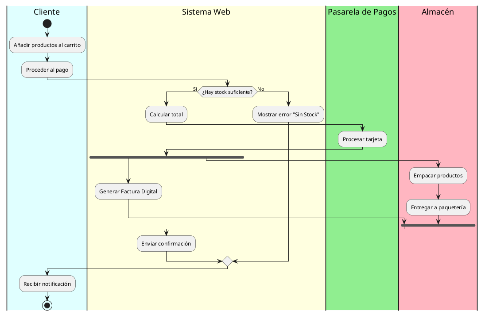

# Ejemplo: Diagrama de Actividades

```plantuml
@startuml
|#LightCyan|Cliente|
start
:Añadir productos al carrito;
:Proceder al pago;

|#LightYellow|Sistema Web|
if (¿Hay stock suficiente?) then (Sí)
  :Calcular total;
  
  |#LightGreen|Pasarela de Pagos|
  :Procesar tarjeta;
  
  |#LightYellow|Sistema Web|
  fork
    :Generar Factura Digital;
  fork again
    |#LightPink|Almacén|
    :Empacar productos;
    :Entregar a paquetería;
  end fork
  
  |#LightYellow|Sistema Web|
  :Enviar confirmación;

else (No)
  |#LightYellow|Sistema Web|
  :Mostrar error "Sin Stock";
endif

|#LightCyan|Cliente|
:Recibir notificación;
stop
@enduml
```
