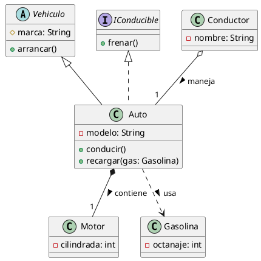

# Ejemplo: Diagrama de Clases

```plantuml
@startuml

abstract class Vehiculo {
  # marca: String
  + arrancar()
}

interface IConducible {
  + frenar()
}

class Auto {
  - modelo: String
  + conducir()
  + recargar(gas: Gasolina)
}

class Motor {
  - cilindrada: int
}

class Conductor {
  - nombre: String
}

class Gasolina {
  - octanaje: int
}

' Herencia / Generalización
Vehiculo <|-- Auto

' Realización / Implementación
IConducible <|.. Auto

' Composición (El Motor vive solo dentro del Auto)
Auto *-- "1" Motor : contiene >

' Agregación (El Conductor existe sin el Auto)
Conductor o-- "1" Auto : maneja >

' Dependencia (Uso transitorio)
Auto ..> Gasolina : usa >

@enduml
```
