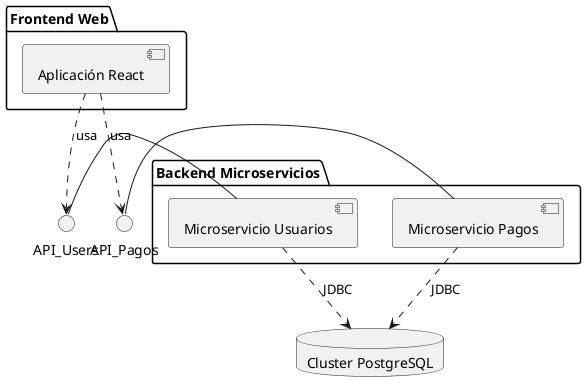

# Ejemplo: Diagrama de Componentes

```plantuml
@startuml
skinparam componentStyle uml2

package "Frontend Web" {
  [Aplicación React] as WebApp
}

package "Backend Microservicios" {
  [Microservicio Pagos] as Pagos
  [Microservicio Usuarios] as Usuarios
}

database "Cluster PostgreSQL" as BD

' Declaración de Interfaces proporcionadas
interface "API_Users" as IUsers
interface "API_Pagos" as IPagos

' Interfaces proporcionadas por los microservicios
IUsers - Usuarios
IPagos - Pagos

' Dependencias de Frontend
WebApp ..> IUsers : usa
WebApp ..> IPagos : usa

' Los microservicios dependen de la BD
Usuarios ..> BD : JDBC
Pagos ..> BD : JDBC
@enduml
```
