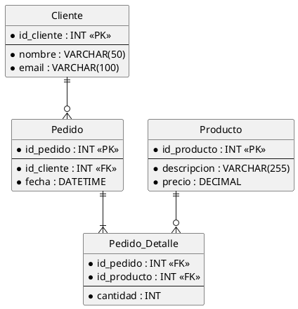

# Ejemplo: Diagrama Entidad-Relación (ER)

```plantuml
@startuml
hide circle
skinparam linetype ortho

' Modificadores para PlantUML ER Moderno
entity "Cliente" as cliente {
  * id_cliente : INT <<PK>>
  --
  * nombre : VARCHAR(50)
  * email : VARCHAR(100)
}

entity "Pedido" as pedido {
  * id_pedido : INT <<PK>>
  --
  * id_cliente : INT <<FK>>
  * fecha : DATETIME
}

entity "Producto" as producto {
  * id_producto : INT <<PK>>
  --
  * descripcion : VARCHAR(255)
  * precio : DECIMAL
}

entity "Pedido_Detalle" as detalle {
  * id_pedido : INT <<FK>>
  * id_producto : INT <<FK>>
  --
  * cantidad : INT
}

' Relaciones
cliente ||--o{ pedido
pedido ||--|{ detalle
producto ||--o{ detalle
@enduml
```
