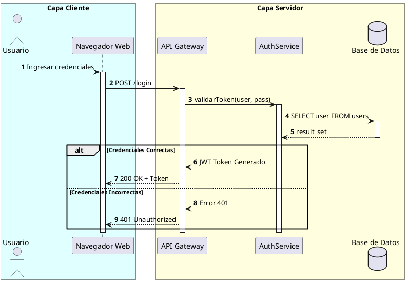

# Ejemplo: Diagrama de Secuencia

```plantuml
@startuml
autonumber

box "Capa Cliente" #LightCyan
actor Usuario
participant "Navegador Web" as UI
end box

box "Capa Servidor" #LightYellow
participant "API Gateway" as API
participant "AuthService" as Auth
database "Base de Datos" as BD
end box

Usuario -> UI : Ingresar credenciales
activate UI

UI -> API : POST /login
activate API

API -> Auth : validarToken(user, pass)
activate Auth

Auth -> BD : SELECT user FROM users
activate BD
BD --> Auth : result_set
deactivate BD

alt Credenciales Correctas
    Auth --> API : JWT Token Generado
    API --> UI : 200 OK + Token
else Credenciales Incorrectas
    Auth --> API : Error 401
    API --> UI : 401 Unauthorized
end

deactivate Auth
deactivate API
deactivate UI
@enduml
```
