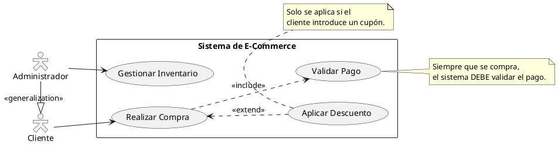

# Ejemplo: Diagrama de Casos de Uso

```plantuml
@startuml
skinparam actorStyle hollow
left to right direction

actor "Cliente" as cliente
actor "Administrador" as admin

rectangle "Sistema de E-Commerce" {
  usecase "Realizar Compra" as UC_Compra
  usecase "Validar Pago" as UC_Validar
  usecase "Aplicar Descuento" as UC_Descuento
  usecase "Gestionar Inventario" as UC_Inventario
}

cliente --> UC_Compra
admin --> UC_Inventario

' Relación de inclusión (Obligatorio)
UC_Compra ..> UC_Validar : <<include>>
note right of UC_Validar : Siempre que se compra,\nel sistema DEBE validar el pago.

' Relación de extensión (Opcional)
UC_Descuento .u.> UC_Compra : <<extend>>
note bottom of UC_Descuento : Solo se aplica si el\ncliente introduce un cupón.

' Generalización de actores
admin -|> cliente : <<generalization>>
@enduml
```
